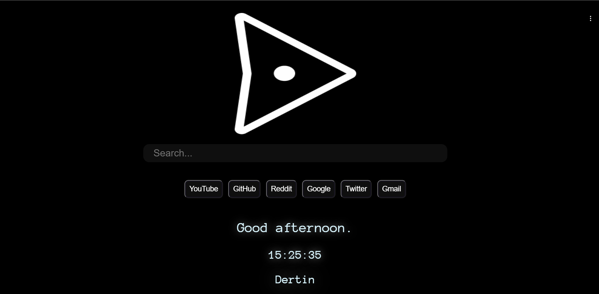

  <h1>DERTIN</h1>
  

<!--
-->

## ABOUT
**Dertin** is a custom home page for your browser, acess the web from your home page. Made for ~~Minimalists~~ Everyone.

> Preview: https://dhrxvjhx.github.io/Dertin/

### [Features ](https://github.com/dhrxvjhx/Dertin/wiki/Features)
· Direct access to 6-Websites with Search Features 
· Google Search 
Read our [**docs**](https://github.com/dhrxvjhx/Dertin/wiki/Features) for full info

## Setting Up
### [Installation and Update can be located at our docs](https://github.com/dhrxvjhx/Dertin/wiki/Installation&Update)

